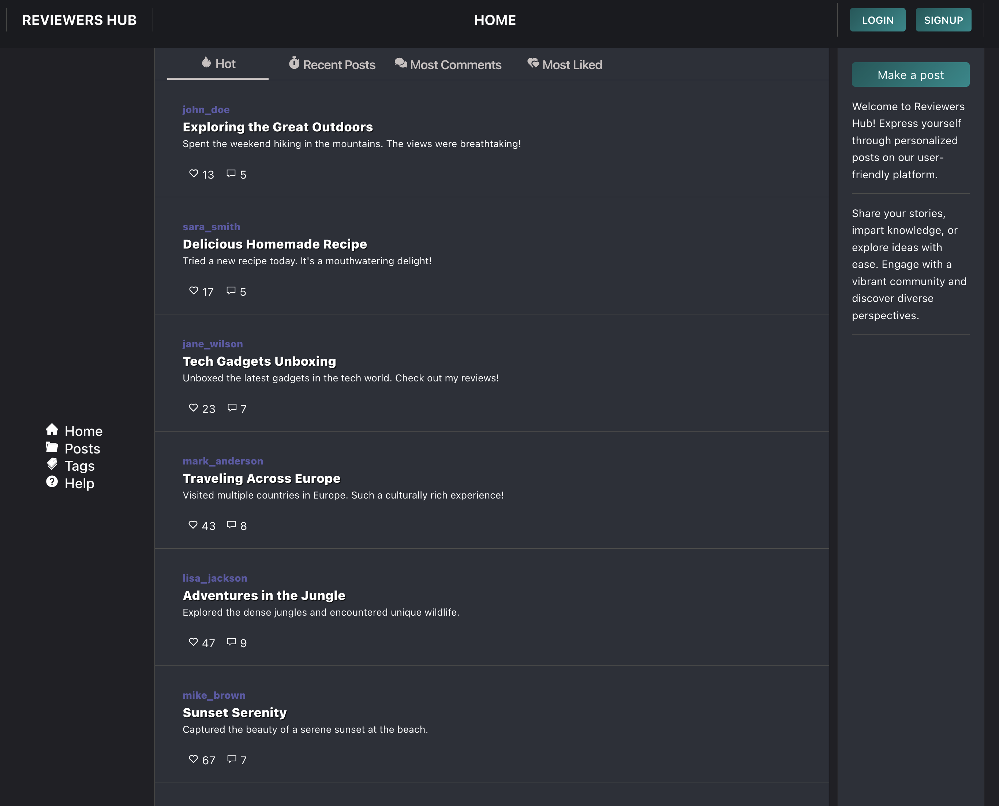
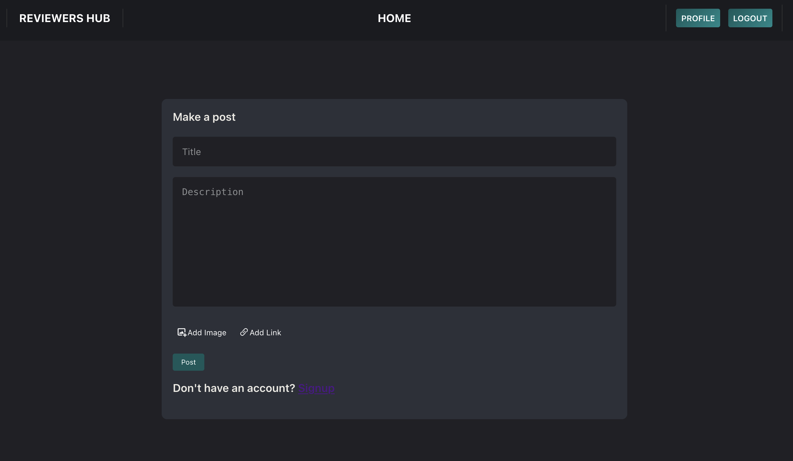
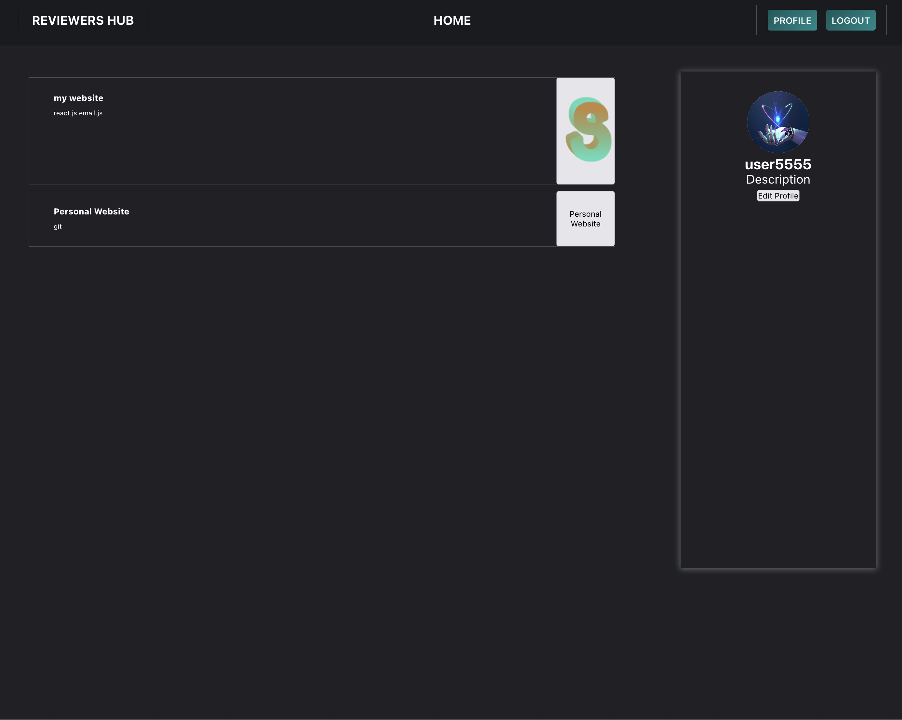
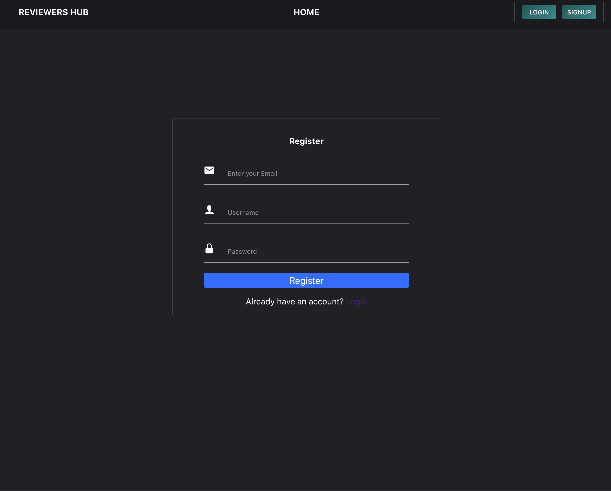

# Reviewers Hub

- **Website:** https://reviewershub.com/

Reviewers Hub is a web platform where users can create and share personalized posts. This project is currently under development and aims to provide a dynamic and user-friendly space for expressing ideas, sharing stories, and engaging with a vibrant community.

### Current Pogress




## Features

- **Make a Post:** Users can create and publish posts with ease.
- **Explore Diverse Perspectives:** Engage with a diverse community and discover a variety of perspectives.
- **Interactive Interface:** The platform offers a user-friendly interface for seamless content creation.

## Technologies Used

- **Frontend:** React.js
- **Backend:** Django Python: https://github.com/tamusandesh99/hubbackend.git
- **Database:** PostgreSQL
- **Styling:** SCSS

## Getting Started

1. Contribute:

   ```bash
    - Fork the repository.
    - Create a new branch for your feature/bugfix.
    - Make your changes and submit a pull request.